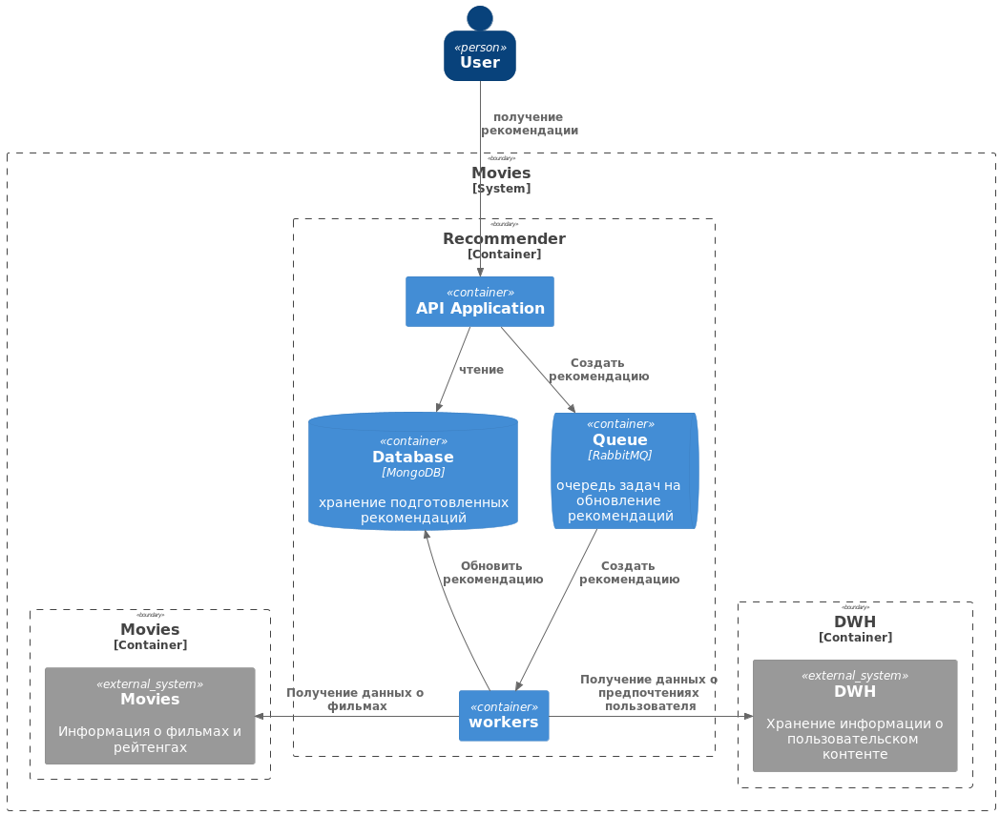
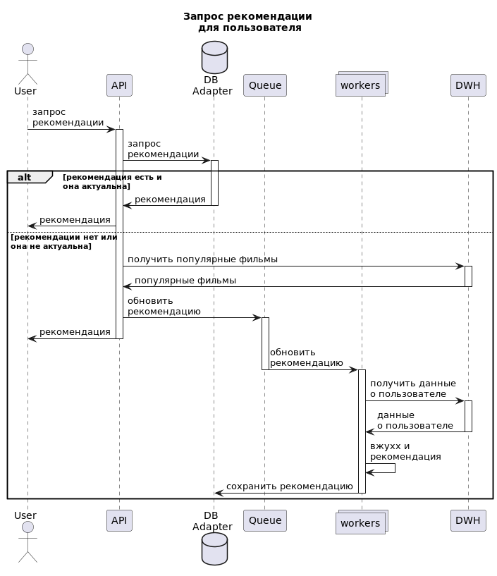

# Проектная работа: Рекомендательная система
Основной причиной создания сервиса является необходимость в повышение уровня вовлеченности пользователей с помощью рекомендаций.

### План проекта
1. Подготовка технической документации по проекту
   1. Подготовка плана
   2. Архитектура проекта
2. Разработка базового сервиса рекомендаций
   1. Подготовка инфраструктуры сервиса рекомендаций в виде docker-compose.yaml
      1. DB - MongoDB
      2. Queue - RabbitMQ
   2. Реализация сервиса выдающего в качестве рекомендации наиболее рейтинговые фильмы
      1. по жанрам
      2. без фильтрации
3. Разработка сервиса рекомендаций
   1. Поиск подходящего датасета для обучения моделей
   2. Подготовка ML моделей для рекомендательных систем:
      1. Исследование ML моделей для рекомендательных систем:
         1. Content based - для сценария рекомендаций похожих на фильм фильмов
         2. Colabrate filtering - для сценария персонифицированные рекомендации фильма для пользователя
      2. Тестирование моделей с целью подбора оптимальных гиперпараметров
      3. Обучение выбранных в процессе исследования моделей с оптимальными гиперпараметрами
   4. Модификация базового сервиса рекомендаций:
      1. Базовые рекомендации становятся бекофом
      2. Встраивание моделей в сервис как основной вариант получения рекомендаций.
4. Тестирование работы сервиса и написание автотестов.
5. Сдача проекта.

## Архитектура системы

## Технических ограничения
 - Запросы не должны отдаваться более 300 миллисекунд.
 - Код приложения должен быть чувствителен к входным данным и выдавать соответствующие коды и тексты ошибок. Не должно быть ответа сервера с кодом 5ХХ.

### Основные сценарии использования сервиса
 - Персонифицированная рекомендация фильма для пользователя 
 - Рекомендация похожих на фильм фильмов
 - бекофф - статическая рекомендация(наиболее популярные или рейтинговые фильмы) в случае недоступности сервиса рекомендаций.

#### пример запроса персонифицированной рекомендации фильма для пользователя 

запрос рекомендации похожих на фильм фильмов отличается только входными данными

## Рекомендательные системы
### Content based
 - косинусное расстояние между названиями фильмов
 - статистика по схожим признакам
 - ...

### Colabrate filtering
 - по пользователям со схожими запросами

## Метрика
 - f1 между тестовой выборкой и рекомендациями модели
 - второй вариант оценка косинусного расстояния между полученными рекомендациями
